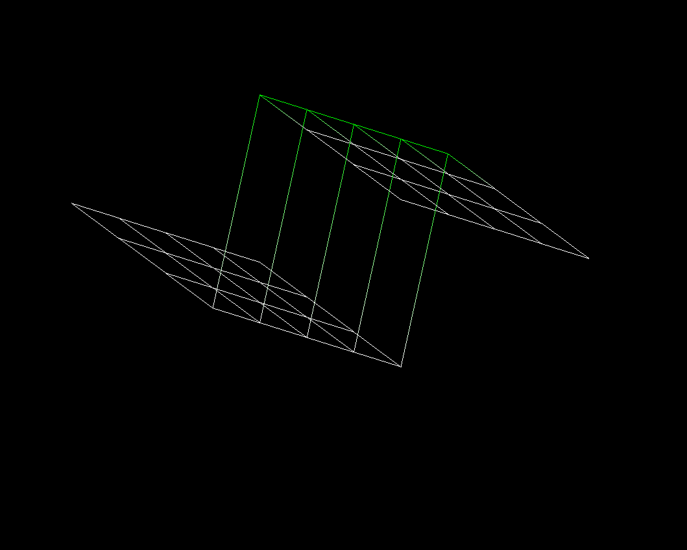

## FDF Linux 

*Program that reads a file containing terrain data and renders a 3D wireframe representation of that landscape in a graphical window on Linux*

**Languages & Tools:** C, MiniLibX, Graphics rendering, Coordinate transformations, Linked lists

**Skills:** 2D/3D graphics, geometry, event handling, algorithm design

### Something interesting about this project ✨

First graphical project
discover chained lists
had some fun 
couleurs pas très bien gérées




### 🖥️ Compilation & Usage

See avaible files in maps folder

```bash
$> make
$> ./fdf 10-70.fdf 
$> ./fdf pyramide.fdf
$> ...
$> make bonus
$>./fdf_bonus pyra.fdf
$> ...
```


Commands on bonus mode:
`+` / `-` zoom 

`/` / `*` scale on z axe

`4 arrays` translations x / y axes

views:
`p` plan · `f` front · `s` side · `v` iso 30° · `b` iso 45°


colors: 
`1` original colors · `2` white · `3` blue · `4` gradient · `5` gradient 

delete layers:
`z` on axe 1 · `x` on an axe 2

<video controls src="pyra2.webm" title="Title"></video>
